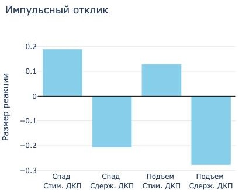

### О проекте

Этот проект был выполнен в среде Google Colab. Вы можете ознакомиться с ним по следующей ссылке:
https://drive.google.com/drive/folders/1LLf6gLJ3O4BwzXG-F1Cj53iDvpcA_YbR?usp=sharing

## 0. Мотивация

 Интеграция глубинного обучения в эконометрическое моделирование позволяет более точно учитывать асимметричные эффекты и нелинейности, которые возникают в ответ на монетарные шоки. Например, использование нейронных сетей в сочетании с методами локальных проекций (Local Projections) открывает новые возможности для изучения динамики временных рядов в условиях шоков различной интенсивности.

## 1. Данные

 Для сопоставимости результатов используются месячные данные по экономике США за 1988–2019 годы. Шок ДКП аппроксимируется через колебания цен финансовых активов в момент объявления решений, как предложено в [Bauer and Swanson(2023)]. Рассматриваются следующие макроэкономические показатели: промышленное производство, уровень безработицы и индекс потребительских цен, индекс цен на товары, премия за риск корпоративных облигаций, доходность 2-летних казначейских облигаций, ожидаемая инфляция на год вперёд. Основными источниками данных являются Федеральная резервная система США, Бюро статистики труда и информационная платформа Bloomberg.

## 2. Методология

Исследование основывается на модифицированной модели локальных проекций, которая традиционно используется для оценки импульсного отклика переменной y на шок e. Основное уравнение локальных проекций имеет вид:

$$
\Delta y_{t+h} = \alpha_h + \beta_h^{\text{ols}} e_t + \delta_h X_t + \varepsilon_{t+h},
$$

где $$\Delta y_{t+h}\$$ — изменение переменной $$y$$ на горизонте $$h$$, $$e_t$$ — шок, $$X_t$$ — вектор контрольных переменных, $$\beta_h^{\text{ols}}$$ — коэффициент, описывающий линейный эффект шока, а $$\varepsilon_{t+h}$$ — случайная ошибка.

## 3. Архитектура модели

 В данной работе модель расширена с использованием методов глубинного обучения, что позволяет учесть нелинейные компоненты и асимметрию в реакции переменной на шоки. Модифицированное уравнение принимает вид:

$$
\Delta y_{t+h} = \alpha_h + \beta_h e_t + \gamma_h f(e_t, S_t) + \delta_h X_t + \epsilon_{t+h},
$$

где $$\beta_h$$ — коэффициент, оцениваемый нейронной сетью, $$f(e_t, S_t)$$ — нелинейная функция, моделирующая взаимодействие шока $$e_t$$ и состояния экономики $$S_t$$, с параметрами, обучаемыми в составе нейронной сети.

 Рис. 1: Архитектура нейронной сети для оценки влияния шока ДКП с учетом асимметрии и нелинейных связей.

## 3. Результаты

На рисунке 2 представлены оценки импульсных откликов, рассчитанные на основе разницы в прогнозах моделей. Стимулирующие и сдерживающие шоки соответствуют значениям $$et =−2$$ и $$et = +2$$ соответственно. Стандартизованная переменная состояния экономики ($$St$$) равна 1 во время подъема и -1 во время спада.Все остальные переменные для прогнозов взяты на уровне средних значений в определенной фазе цикла.

Анализ импульсных откликов показывает асимметрию влияния ДКП в разных фазах экономического цикла, особенно на горизонте 3–6 месяцев. В период спада стимулирующая политика наиболее эффективна, значительно увеличивая промышленное производство, тогда как в фазе подъема её эффект снижается. Сдерживающая политика, напротив, сильнее действует в фазе подъема и почти не влияет в период спада. Эти результаты подчеркивают важность учета экономического цикла при выборе инструментов ДКП.

    
    
Рис. 2: Импульсные отклики индекса промышленного производства на шоки сдерживающей или стимулирующей монетарной политики при различных фазах экономического цикла.

 

Таким образом, предложенная методология сочетает в себе преимущества локальных проекций для интерпретации результатов и гибкость нейронных сетей для моделирования нелинейных эффектов и асимметричных реакций экономических переменных на монетарные шоки.

